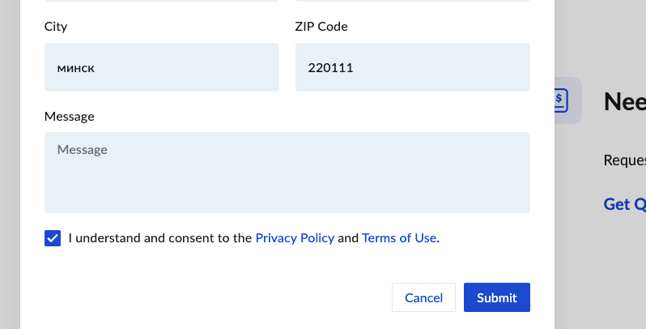

# <h1>Hexnode: </h1>how to add a payment card

## step-by-step instruction 
<pre>tips: It's better to enable two-factor authentication right away.</pre> 

1. At the buttom of administration menu at the left side find: <b>License </b> and choose U

<h6>Picture 1</h6>
After you press <b>Subscribe </b> appear the menu: 

<h6>picture2</h6>

Press <b>Request pricing</b>
shows menu - filling fields

<h6>picture 3</h6>

after fillig all fields and accepting the pricing policy - press <b>Submit </b>
it will sent request to support team
