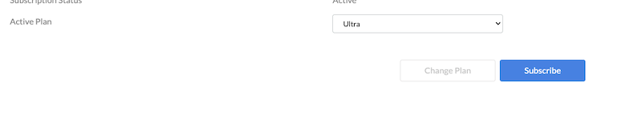

# <h3>Hexnode</h3> how to add a payment card

## step-by-step instruction 
<pre>tips: It's better to enable two-factor authentication right away.</pre> 

At the buttom of administration menu at the left side find: <b>License </b>

Press <b>Submit </b> Apper the menu 

after fillig all fields press <b>Submit </b>

