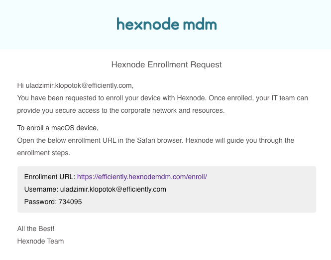
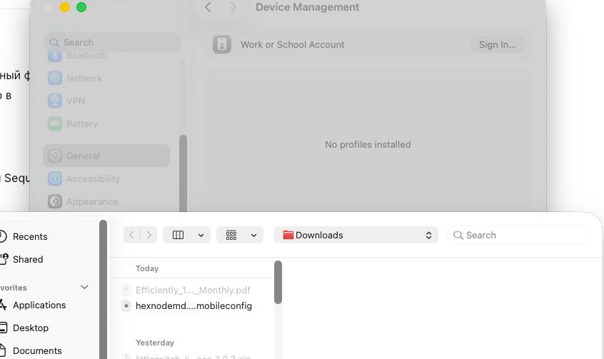
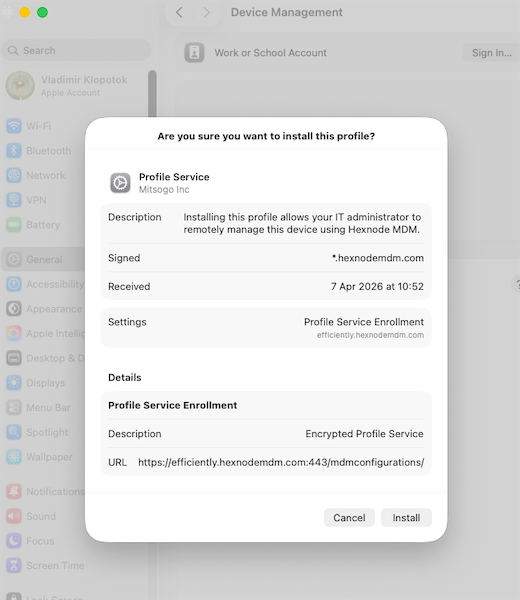
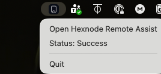
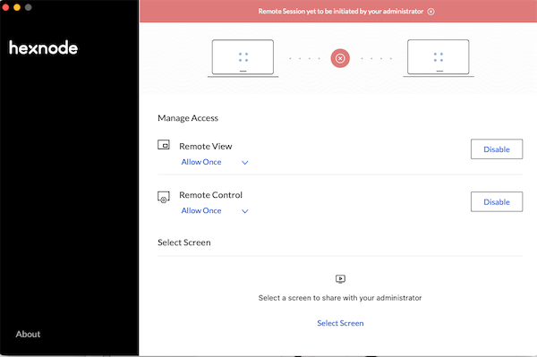
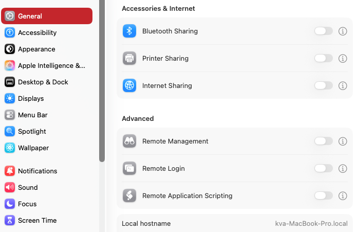

# <h1>Hexnode: <b>Macos</b> Import security profile</h1>

1. Переходим по указанной в письме ссылке и авторизуемся с указанными в письме Username/Password 

после авторизации скачивается файл конфигурации.

2. Далее, заходим в системные настройки:  ⌘ + Пробел (Command + Space). <b>System Settings</b>

где выбираем <b>General</b> - <b>Device Managment</b>

3. Добавляем скачанный профиль настроек: 

<pre>  Имя профиля hexnodemdm-2.mobileconfig  и находится в папке Downloads </pre> 
 После выбора файла появится дважды окна импорта :
 
 
 
4. Нажимаем <b>Install </b>профиль успешно добавлен

5. Перезагружаем ОС.

6. После перезагрузки в системном треее установятся 2 приложения: <b>Hexnode UEM</b> и <b>Hexnode Remote Assist</b>
 
 
 
<pre>Для успешного подключения статус Remote Assist должен быть: success </pre>
 
 7. В Hexnode Remote Assist можно задавать разрешения для подключения к устройству:
 
 - Удаленный просмотр экрана
 - Удаленное управление
 
 
 
8. Проверяем настройки безопасности системы:

**General → Sharing**

*(Иконка: информационный кружок)*
Справа от каждого переключателя находится кнопка с буквой **i** в кружке. Нажмите на неё, чтобы настроить доступ для каждого сервиса.

- **Remote Management** → Разрешить доступ для: **All users**
- **Remote Login** → Разрешить доступ для: **Administrators**
- **Remote Application Scripting** → Разрешить доступ для: **Administrators**
 

 
  
 
 
 
 
 
 
 
 
 
 
 
 
 
