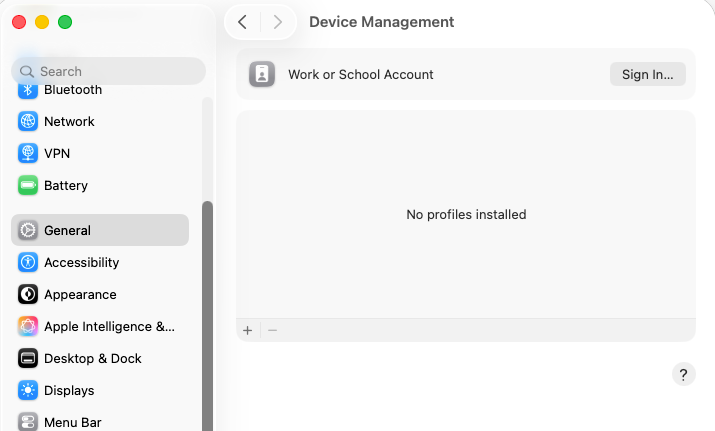

# <h1>Hexnode: <b>Macos</b> Import security profile</h1>

<pre>tips: Cert as usual store in Downloads folder</pre> 

1. 

<h6>Picture 1</h6>
2. After you press <b>Subscribe </b> appear the menu: 

<h6>picture2</h6>

3. Press <b>Request pricing</b>

<h6>picture 3</h6> 

Shows menu (Pictre 3) - fill the fields after this accepting the pricing policy - press <b>Submit </b>
it will sent request to support team