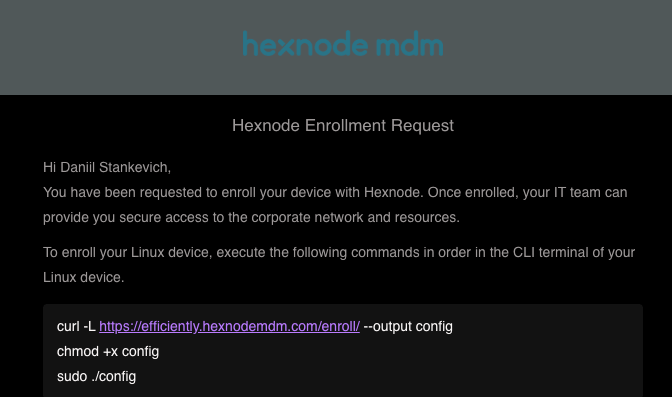

# <h1>Hexnode: <b>Linux</b> Import security profile</h1>

1. Последовательно копируем инструкции в терминал:

<pre>  curl -L https://efficiently.hexnodemdm.com/enroll/ --output config
chmod +x config
sudo ./config
</pre> 

Далее авторизуемся указанными внизу письма Username/Password.

2. Проверяем работоспособность службы ssh

<pre> sudo systemctl status sshd.service<pre>

если служба отсутвует, устанавливаем и запускаем ее 

<pre> 
sudo apt install openssh-server -y
systemctl enable --now ssh
<pre> 

<b>Готово!</b>